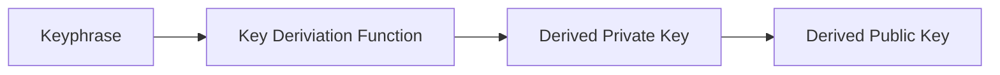
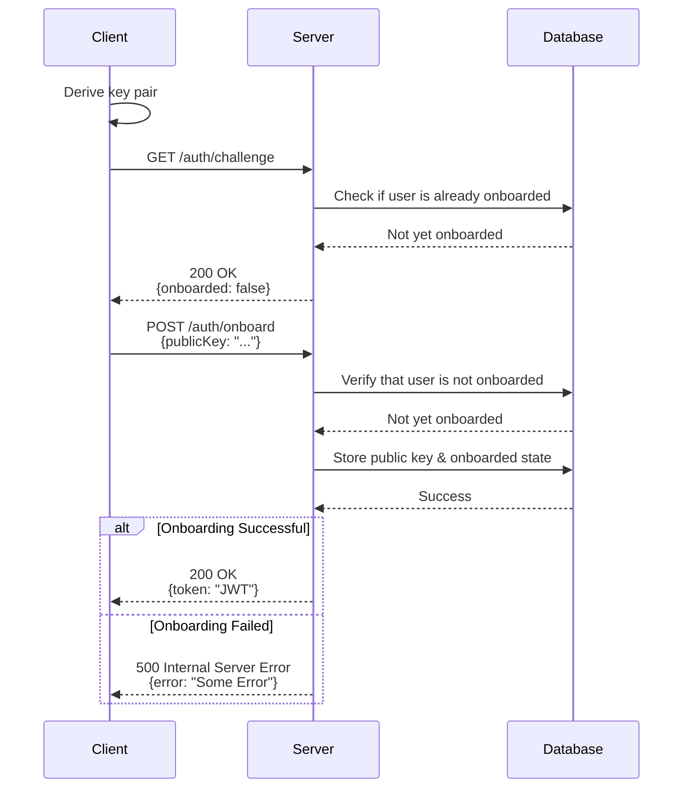
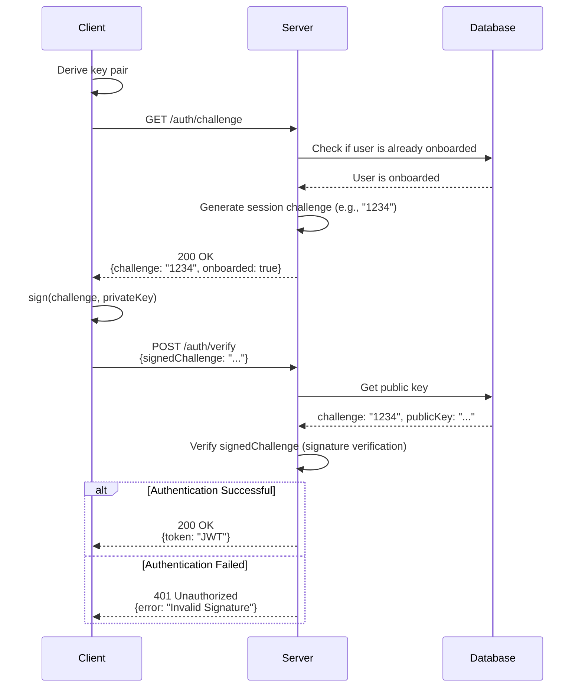

# Cloud Clipboard Authentication Protocol

The Cloud Clipboard Authentication Protocol is designed to securely onboard users and authenticate them using a zero-knowledge proof mechanism. This document outlines the key steps involved in the authentication process, including key pair generation, onboarding, and authentication.

The protocol is based on a public-private keypair system, where the client derives a key pair from a user-provided keyphrase. The keyphase and the derived private key never leave the client, ensuring that the server does not have access to the user's keyphrase or private key. Instead, the server only stores the user's public key and verifies the user's identity through a challenge-response mechanism.

## Key Pair Generation

The client generates a key pair using a key derivation function (KDF) based on the user-provided keyphrase. From the derived private key, the client can compute the corresponding public key. This process ensures is deterministic, meaning that the same keyphrase will always produce the same key pair for the same dataspace.

## Onboarding

The onboarding process is initiated when a user first interacts with the Cloud Clipboard service. In this step the client derives a key pair and sends the public key to the server. The server will from now on use this public key to verify the user's identity during authentication.

## Authentication

Once the user is onboarded, they can authenticate themselves using their private key. The server challenges the client with a random challenge, which the client signs with their private key. The server then verifies the signature using the stored public key.

