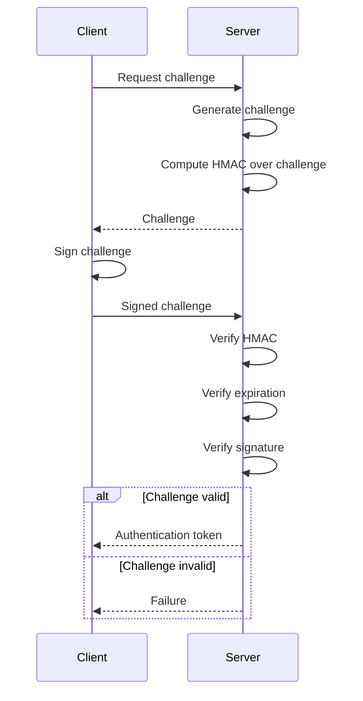

# Challenge-Response Design Proposal

This document describes a potential design of the challenge which needs to be signed by the client to prove that it has access to the private key/clipboard key.

## Issues with Current Design

During the development of the Cloud Clipboard protocol, it was discovered that the current authentication setup is not ideal for horizontal scaling, which involves adding multiple instances of an application to distribute load, compared to vertical scaling, which increases the capacity of a single instance by adding resources such as CPU or memory.

In the protocol, as of right now, it is always assumed that the "Server" component is the same for each request. While other components (for example jwt) allow for horizontal scaling due to their stateless nature, the current challenge protocol design requires a session state on the backend. This session state is used to verify the signed challenge with the originally generated one to prevent malicious actors from sending a different (for example older) signed challenge.

This session state is not stored on the database hence it is impossible for a second ``Server'' instance to know if this is the originally generated challenge or not.

## Requirements

- The challenge should be unique for each session
- The server should be able to independently verify the integrety of the challenge without having to check the database, allowing for stateless verification
- The challenge should be signed by the client and verified by the server
- The challenge should contain meta-information about the session like the issued time, the expiration time, and the client's IP address

## Design

The challenge is a base64 encoded JSON object that contains the following fields:

- `session_id`: A unique identifier for the session
- `issued_at`: The time at which the challenge was issued
- `expires_at`: The time at which the challenge expires
- `client_ip`: The IP address of the client

The JSON object is followed (separated by ".") with an base64 encoded HMAC of the base64 encoded JSON object using the server's secret key, only known to server instances.

When the client receives the challenge, it signs the base64 encoded JSON object **and** server signature with its private key (for backwards compatibility), appends the base64 encoded signature to the challenge (separated by "."), and sends it back to the server. The server then verifies the signature using the client's public key and the HMAC using the server's secret key.

The server also checks if the challenge has expired, sent by the same client IP address, and if the signature is valid. If all checks pass, the server issues an authentication token to the client.



## Sample Challenge

### Server issued challenge

**Structure:**

```javascript
base64UrlEncode({
    "session_id": "123456",
    "issued_at": 1516239022,
    "expires_at": 1516239322,
    "client_ip": "178.197.222.184" // IPv4 or IPv6 depending on the access
}).base64UrlEncode(<Server-HMAC>)
```

**Example:**

`eyJzZXNzaW9uX2lkIjoiMTIzNDU2IiwiaXNzdWVkX2F0IjoxNTE2MjM5MDIyLCJleHBpcmVzX2F0IjoxNTE2MjM5MzIyLCJjbGllbnRfaXAiOiIxNzguMTk3LjIyMi4xODQifQ.MDY3OWYwMjdiMGE2Y2E5Mjk5Mjc4Mjc2ZDQzMDk5NDBhZjgyOGI3MzdjOTY3OGZkZTkyNzhhNTg3YTllZmFiOQ`

### Client signed challenge

**Structure:**

```javascript
base64UrlEncode({
    "session_id": "123456",
    "issued_at": 1516239022,
    "expires_at": 1516239322,
    "client_ip": "178.197.222.184" // IPv4 or IPv6 depending on the access
}).base64UrlEncode(<Server-HMAC>).base64UrlEncode(<Client-Signature>)
```

**Example:**

`eyJzZXNzaW9uX2lkIjoiMTIzNDU2IiwiaXNzdWVkX2F0IjoxNTE2MjM5MDIyLCJleHBpcmVzX2F0IjoxNTE2MjM5MzIyLCJjbGllbnRfaXAiOiIxNzguMTk3LjIyMi4xODQifQ.MzM4N2RkMmY0MmYwMjhmN2I0YjZhMmUwNjYzZDhjYWMzOGUwNDlmYjc4MjkyY2IzOTJhMjBjNzBkNWE1N2M4Mg==.MzA0NTAyMjAyYzkwYWY3ZWY2OWY3NTI4MTM1YzUwM2M5OGNmMDNhMTI4NDFkZDY1MGEzNmEyNWI0NjU3NDZkYjMwY2JmNDE3MDIyMTAwOTUyOTkxOGQ3MmZhMDY3NGExZGU0Nzg4ZWNlYjAxYWIwYTAzZTdkNmI3MTY2NDM4M2RhNzM3NjI0OTVjYmM1Yw==`