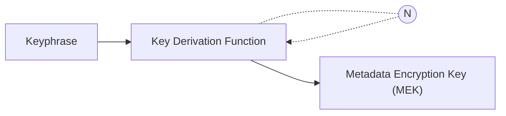
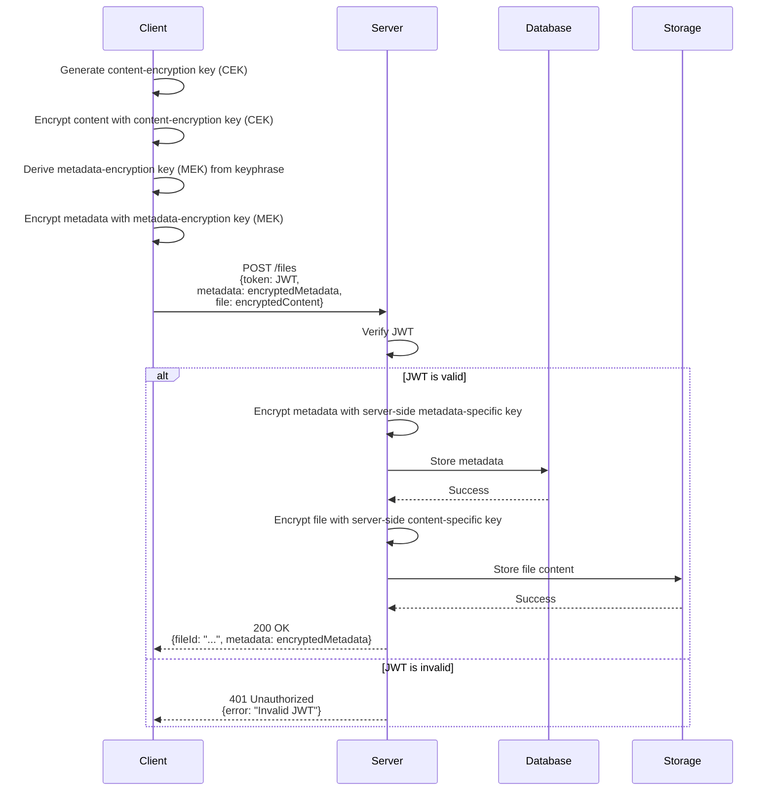
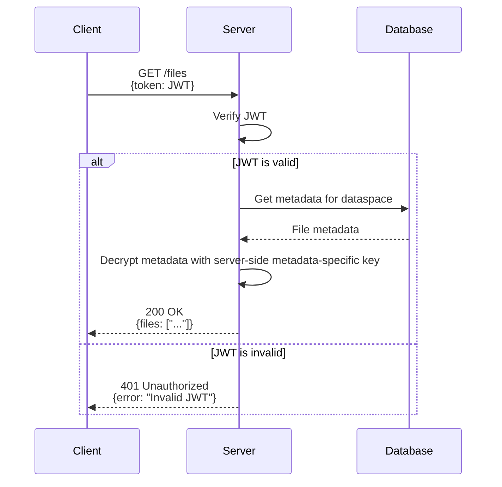
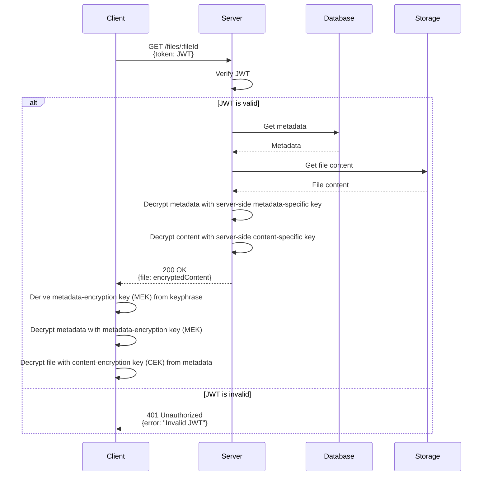
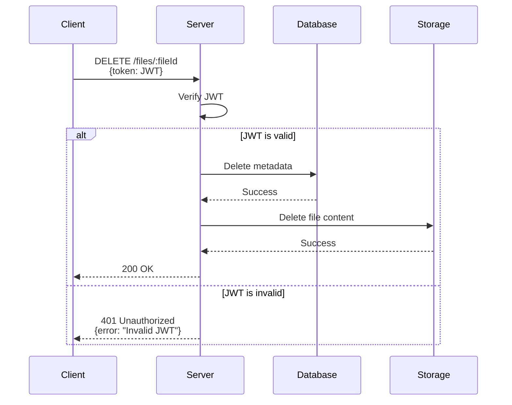
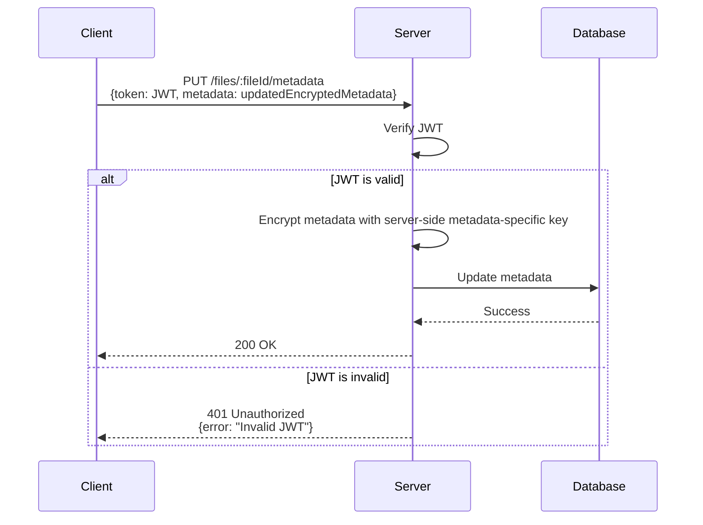

# File Download and Upload

The Cloud Clipboard generates a content-encryption key (CEK) for each file that is uploaded. This CEK is used to encrypt the actual file content. The CEK is then encrypted together with other file metadata with a single wratched metadata-encryption key (MEK). The MEK is derived from the keyphrase and is used to encrypt the metadata for the file.

When a file is uploaded, the metadata is encrypted with the MEK and stored in the database. The actual file content is encrypted with the CEK and stored in a storage service.

When a file is downloaded, the metadata is decrypted with the MEK and the file content is then decrypted with the CEK from the decrypted metadata.

## Key Ratcheting

To make sure that not every metadata is encrypted with the bare keyphrase, a derived ratcheted key is used (MEK). This ensures, that if the MEK for any given metadata is compromised, only the following metadata is compromised and not the previous ones.

In the key ratcheting approach the keyphrase is passed through a key derivation function (KDF) for each metadata entry (N) to generate the MEK.

To improve performance, only the first pass through the KDF is done with a high configuration. Any subsequent passes are done with a lower configuration, which is sufficient to derive the key for the next metadata entry.

### CRUD Operations

The following sections describe the CRUD operations for file management in the Cloud Clipboard, including uploading, retrieving, downloading, deleting, and updating file metadata. The sequence diagrams illustrate the interactions between the client, server, database, and storage components.

## Uploading Content

## Get Files Metadata

## Downloading Content

## Deleting Content

## Update Metadata

Updating the metadata of a file is required for example when the user wants to rename a file, add additional metadata or change their keyphrase.

